# Data Engineering Project II - Group 2

## Web Application

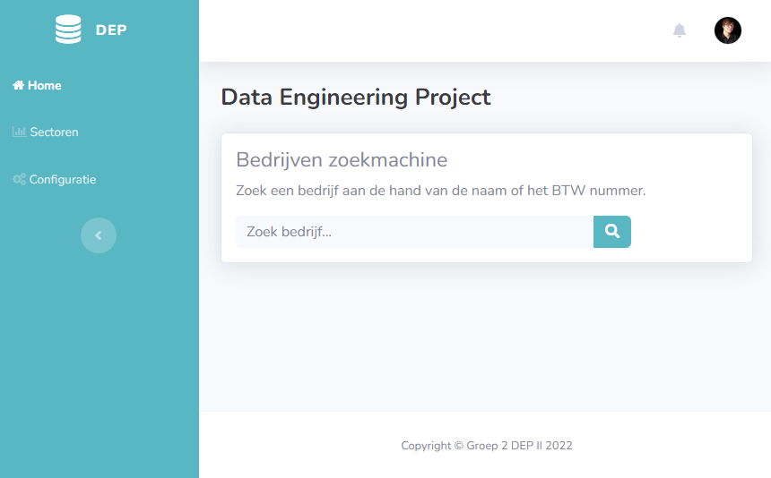

### Setup

1. Start de backend API service door gebruik te make van het commando `node index.js` in `/api` (Zorg dat alle packages uit [requirements.txt](https://github.com/BrechtDeSchryver/DEP2G02/blob/main/api/requirements.txt) geïnstalleerd zijn)
2. Start index.html op localhost. Het bestand gewoon openen in de browser zal niet werken. Als u Visual Studio Code gebruikt, kunt u ook de [Live Server](https://marketplace.visualstudio.com/items?itemName=ritwickdey.LiveServer "Extension page") extensie gebruiken.

### Gebruik

#### Bedrijf pagina

Op deze pagina vindt u de basis informatie van een kmo en kunt u bepaalde analyses doen door gebruik te maken van de gegeven grafieken

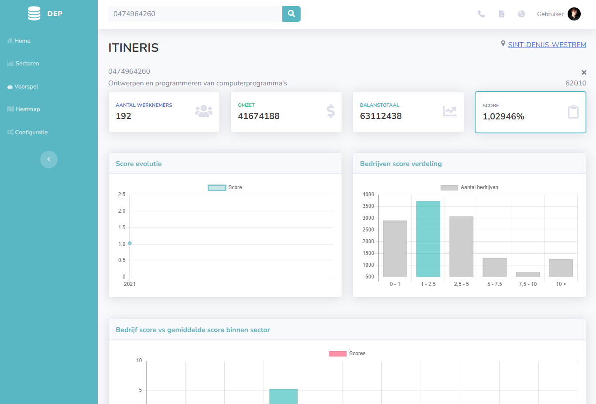

#### Sectoren lijst

Op de pagina met de sectoren lijst staan alle sectoren opgelijst gesorteerd op aantal bedrijven. Deze sortering kan gewijzigd worden door gebruik te maken van de knop met pijl rechts boven de tabel. Het aantal weergegeven bedrijven kan aangepast worden door middel van de selector links boven de tabel. Door op de knop "Details" te klikken gaat u verder naar de pagina van een individuele sector. Door op "Bedrijven" te klikken krijgt u een lijst van alle bedrijven binnen deze sector.

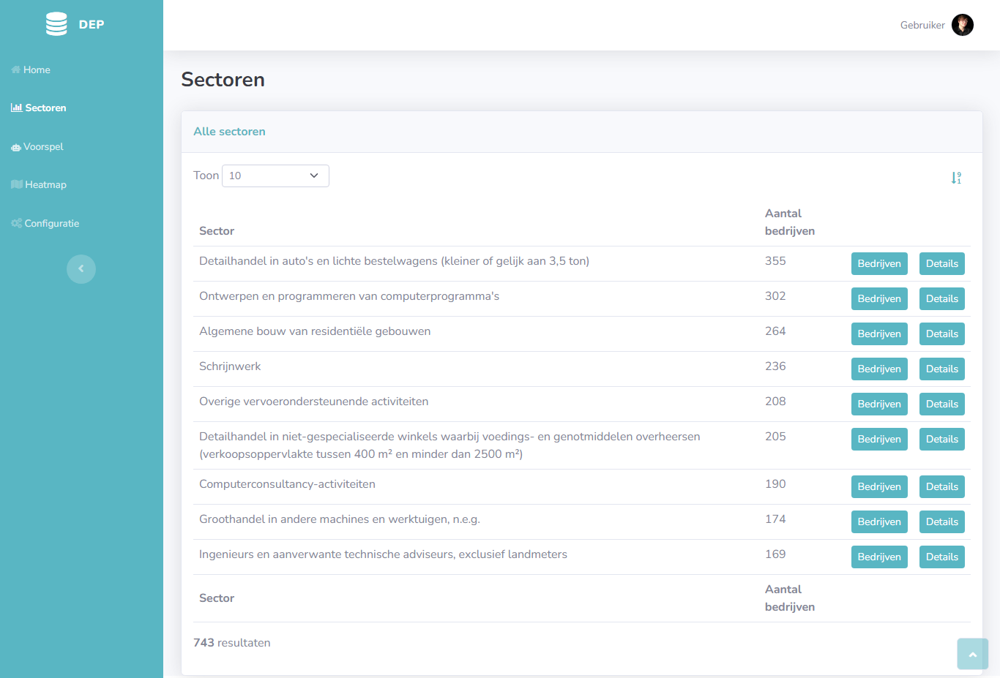

#### Sector pagina

Op deze pagina ziet u de basis informatie over een sector. De grafiek onderaan de pagina toont hoe een bedrijf binnen deze sector gemiddeld scoort per subdomein.

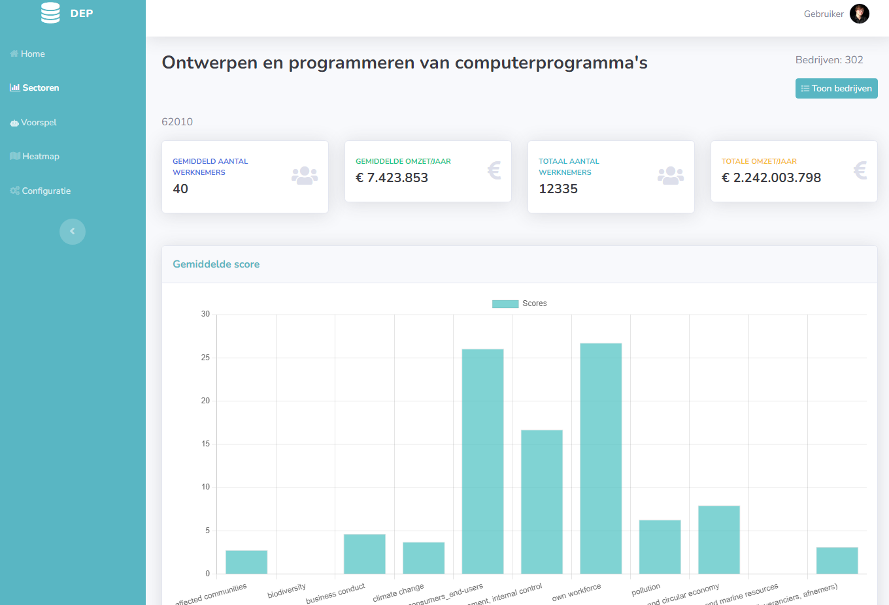

#### Bedrijven pagina

Op deze pagina zien we een lijst van alle bedrijven binnen de gekozen sector uit de sectorenlijst. Wanneer u klikt op de header van een kolom kunt u sorteren op basis van de inhoud van die bepaalde kolom. Als u 2 bedrijven met elkaar wilt vergelijken kunt u deze beide aanklikken op de naam van het bedrijf. Deze worden dan toegevoed aan de "vergelijk lijst" die zich recht bovenaan de pagina bevindt en kunt zien wanneer u op het weegschaal icoon klikt. Wanneer u dan links bovenaan klikt op de knop "Vergelijk (2)", kunt u de statistieken van deze 2 bedrijven vergelijken op de vergelijk pagina.

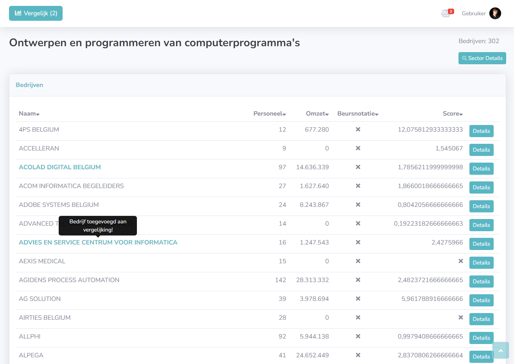

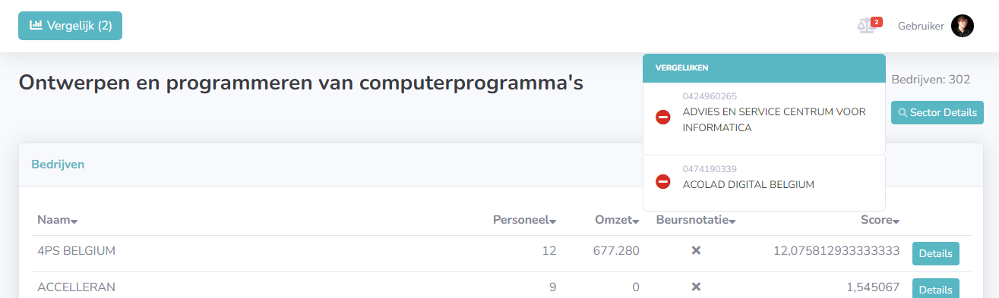

#### Vergelijk pagina

Op deze pagina kunt u de bedrijven gaan vergelijken. U ziet 3 verschillende opties boven elk bedrijf. Deze synchronisseren automatisch onder elkaar waardoor steeds dezelfde gegevens vergeleken kunnen worden met 1 klik. Op de subpagina "Algemeen" vindt u de naam, het ondernemingsnummer en de algemene score voor deze kmo. Op de subpagina Gegevens vindt u de gegevens

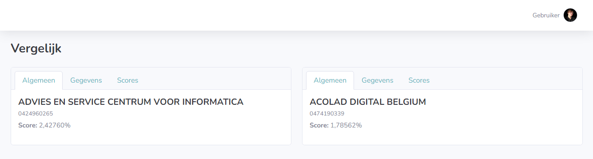

Op de subpagina "Gegevens" vindt u opniew de naam en het ondernemingsnummer. Hier kunnen we ook het adres van het bedrijf zien en kunnen we navigeren naar de website van het bedrijf en eventueel de jaarrekening downloaden.

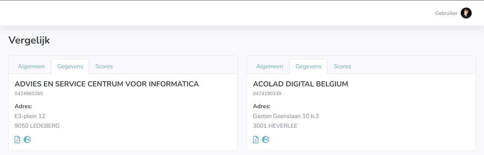

Op de subpagina "Scores" kunt u de scores van de verschillende subdomeinen vergelijken met elkaar.

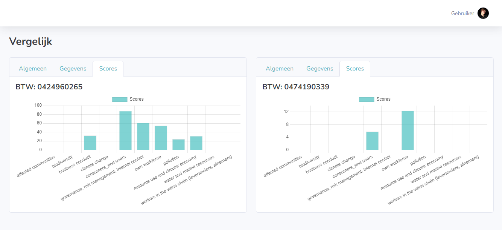

#### Voorspel pagina

Op deze pagina kunt u gebruik maken van onze AI. Deze kan de score van een bedrijf voorspellen wanneer u deze de gevraagde informatie geeft.

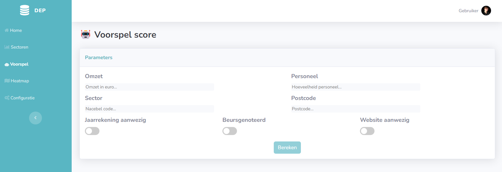

#### Heatmaps pagina

Op deze pagina zijn er 3 heatmaps geplaatst.

Op de eerste heatmap staat de distributie van de kmo's gevisualiseerd.

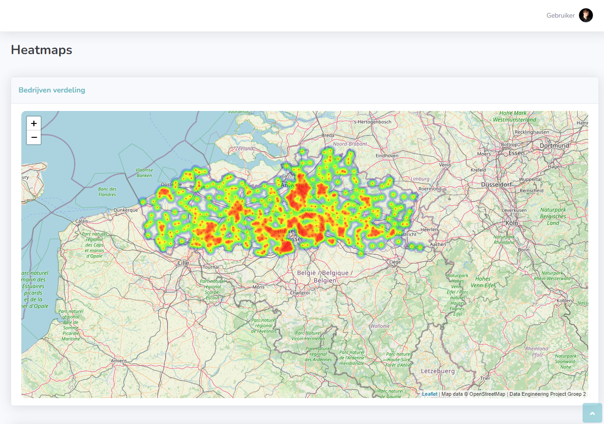

Op de tweede heatmap staan alle individuele scores gevisualiseerd.

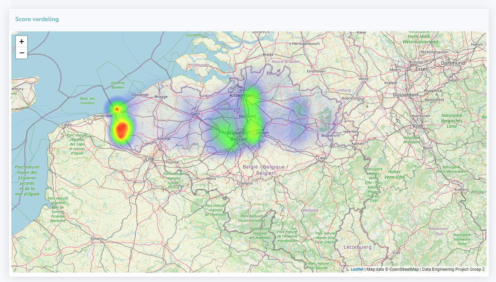

Op de derde en laatse heatmap staan de gemiddelde scores per stad gevisualiseerd.

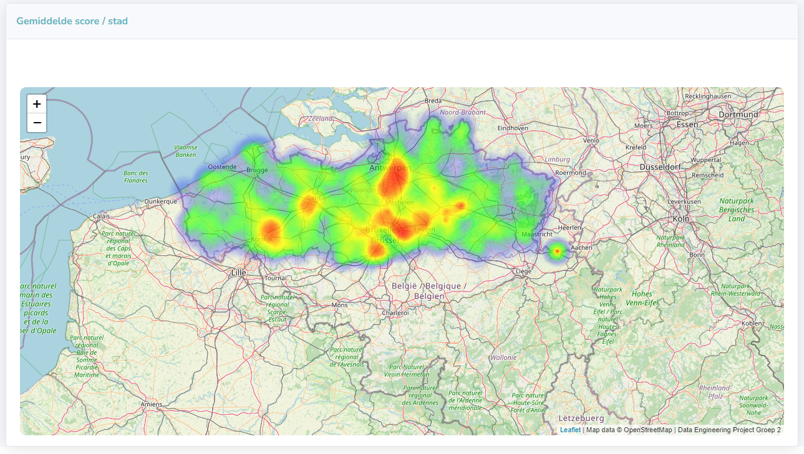

#### Configuratie pagina

Op de configuratie pagina kunnen we de zoektermen aanpassen per subcategorie. Deze zoektermen worden gebruikt om de score te berekenen per kmo. De zoektermen worden gezocht binnen de website en jaarrekeningen van elk bedrijf en op basis hiervan wordt elke score berekend. Wanneer u op de rode knop "Herbereken scores" klikt, worden alle scores voor elk bedrijf opnieuw berekend aan de hand van de zoekwoorden binnen deze pagina. Om de zoekwoorden aan te passen klik je op 1 van de 3 domeinen. U kan dit echter enkel doen wanneer u bent ingelogd. Als dit niet het geval is zal u deze pagina niet kunnen bereiken en meteen doorverwezen woorden naar de login pagina.

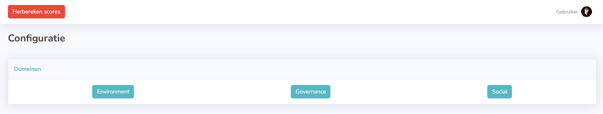

Binnen elk domein kunt u een subdomein kiezen om de zoekwoorden van aan te passen.

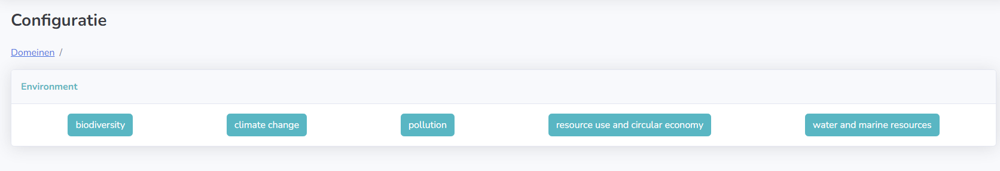

Wanneer u een subdomein heeft gekozen kunt u een bestaande zoekterm verwijderen door op de "Delete" knop naast het woord te klikken. Wanneer u een zoekterm wenst toe te voegen kan in deze invullen in het input veld naast de "voeg toe" knop. Vervolgens klikt u op de knop "Voeg toe". U zal zien dat het ingegeven woord tussen de andere zoektermen zal verschijnen.

#### Login pagina

Op de login pagina kunt u een gebruikersnaam en wachtwoord invoeren. Wanneer deze correct zijn wordt u terug verwezen naar de startpagina en bent u ingelogd. Dit houdt in dat u toegang krijgt tot de configuratie pagina.

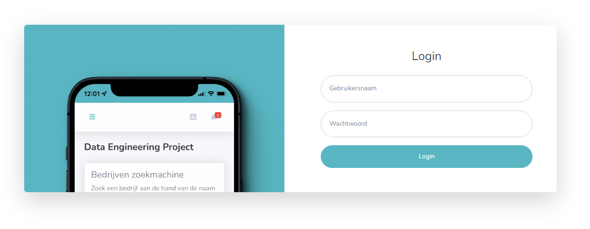
